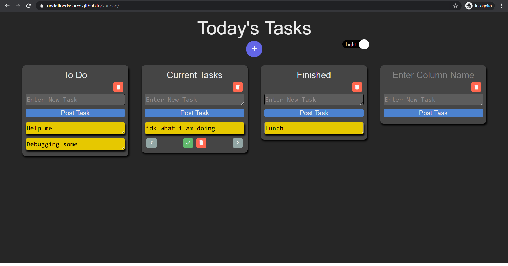

# Kanban
React based Kanban Project

No need to sign up for using a kanban board.
Using a kanban board, you will be able to track of your current tasks, scheduled tasks, and completed tasks.

Warning: This project is not compatible to all broswers. So far, it does not run on Internet Explorer

For now, it does not support data saving functionality since github pages are all static (once web server is active, this project support log-in functionality but will be deployed on a new domain)

